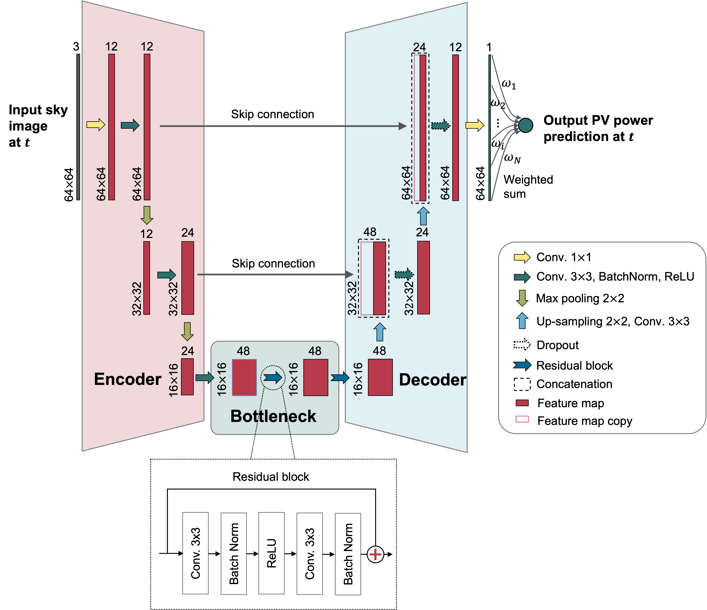

# SkyGPT: Probabilistic Short-term Solar Forecasting Using Synthetic Sky Videos from Physics-constrained VideoGPT

(Include an eye-catching demo animation here, want to show both stochastic video prediction and probabilistic PV output prediction)

---

[**Pre-print**](https://arxiv.org/abs/2306.11682)

The variability of solar photovoltaic (PV) output, driven by rapidly changing cloud dynamics, hinders the transition to reliable renewable energy systems. With the recent advances in generative artificial intelligence, synthesis of possible images of the future sky has potential for aiding in forecasts of PV power output. Here, we introduce *SkyGPT*, a physics-constrained stochastic video prediction model, to generate plausible future sky videos with diverse cloud motion patterns based on past sky image sequences. We demonstrate the potential of using the synthetic future sky images for a 15-minute-ahead probabilistic PV output forecasting task using real-world power generation data from a 30-kW rooftop PV system.

Figure 1: Proposed probabilistic solar forecasting framework.

---

## Code Base and Dependencies

All the codes are writen in Python 3.6.1. The deep learning models are implemented using deep learning framework TensorFlow 2.4.1 (Pytorch xxx) and trained on GPU cluster, with NVIDIA TESLA A100 40GB card. TensorFlow 2.4.1 is compatible with CUDA 11.2.0 and cuDNN 8.1.1.33. Pytorch xxx is compatible with xx. All dependencies are listed in `requirements.txt`. 

| File | Description |
| ------------- | ------------- |
| `.py` | Python file used to |
| `.ipynb` | Jupyter Notebook used to process the raw PV power generation history.  |

## Challenges
Although deep learning-based methods achieve the state-of-the-art in sky image-based short-term solar forecasting[^1], two major gaps exist:

[^1]: Although as yet there is no common agreement on the classification criterion, we use the definition of forecasting horizon less than 30 minutes in this study for short-term solar forecasting.

1. Existing methods often struggle to accurately capture cloud dynamics. Temporal lags in predictions are often observed during cloudy conditions when PV generation rapidly fluctuates.
2. There is commonly lack of uncertainty quantification for solar power predictions, which however is critical to risk management in renewable-heavy grids.

## Stochastic Sky Video prediction
As a first step, we train video prediction models to generate future sky images based on past sky image sequences. We name our proposed stochastic sky video prediction model *SkyGPT*, which is inspired by two emerging video prediction models VideoGPT [[1](#1)] and PhyDNet [[2](#2)]. The SkyGPT follows the general structure of VideoGPT, which consists of two main parts, a vector quantized variational auto-encoder (VQ-VAE) [[3](#3)] and an image transformer [[4](#4)]. The VQ-VAE encompasses an encoder-decoder architecture similar to classical VAEs, but it learns a discrete latent representation of input data instead of a continuous one. The image transformer, as a prior network, is used to model the latent tokens in an auto-regressive fashion, where new predictions are made by feeding back the predictions from previous steps. To enhance the modeling of cloud motion, we incorporate prior physical knowledge into the transformer by adapting a PDE-constrained module called PhyCell from the PhyDNet [[2](#2)] for latent modeling. We call this entire architecture a Phy-transformer (in short of physics-informed transformer) to distinguish it from the transformer component within the architecture. 

Figure 2: SkyGPT for future sky image prediction. The prediction is disentangled in the encoding space by the PhyCell and Transformer. For visualization purposes, the next step encodings predicted by PhyCell and Transformer are decoded, which shows that PhyCell captures the physical pattern of the motion, while Transformer is responsible for filling in the prediction with fine-grained details.

## PV output prediction
As a second step, we train PV output prediction model that learns a mapping from the sky image to concurrent PV power output. Such a mapping can be trained on historical real-world images and then applied to our generated future sky images. An analogy one can think of is the computer vision task of estimating the age of people based on their facial images.

The PV output predictor is based on U-Net [[5](#5)], which has an encoder-bottleneck-decoder architecture and is commonly used in various image segmentation tasks. For the PV output prediction task, a few modifications were made to the architecture of U-Net, including (1) changing the output of the original U-Net to generate a regression result instead of a segmentation map, (2) using residual block for the bottleneck part instead of the classical Convolution-BatchNorm-ReLU structure to ease the network training, (3) pruning the architecture by reducing the number of convolution layers.

Figure 3: Modified U-Net architecture for PV output prediction.

## Dataset
We leverage an in-house dataset ($\mathscr{D}$) with 334,038 aligned pairs of sky images ($\mathcal{I}$) and PV power generation ($\mathcal{P}$) records, $\mathscr{D} = \{(\mathcal{I}_i, \mathcal{P}_i) \mid i\in \mathbb{Z}: 1\leq i\leq 334\mathrm{,}038\}$, for the experiments in this study. Please check out our paper for details about the dataset and data processing steps.

Note: This study was conducted before the official release of our curated dataset [SKIPP'D](https://github.com/yuhao-nie/Stanford-solar-forecasting-dataset) [[5](#5)], which is more organized and has a number of updates from the dataset we used here. We encourage the readers to examine the SKIPP'D dataset.

## Results
### Future Sky Images Generated by Video Prediction Models

### Generated Sky Images for Probabilistic Solar Forecasting

## Reference
<a id="1">[1]</a> 
Yan, W., Zhang, Y., Abbeel, P. and Srinivas, A., 2021. Videogpt: Video generation using vq-vae and transformers. arXiv preprint arXiv:2104.10157.

<a id="2">[2]</a>
Guen, V.L. and Thome, N., 2020. Disentangling physical dynamics from unknown factors for unsupervised video prediction. In Proceedings of the IEEE/CVF Conference on Computer Vision and Pattern Recognition (pp. 11474-11484).

<a id="3">[3]</a>
Van Den Oord, A. and Vinyals, O., 2017. Neural discrete representation learning. Advances in neural information processing systems, 30.

<a id="4">[4]</a>
Chen, M., Radford, A., Child, R., Wu, J., Jun, H., Luan, D. and Sutskever, I., 2020, November. Generative pretraining from pixels. In International conference on machine learning (pp. 1691-1703). PMLR.

<a id="5">[5]</a>
Nie, Y., Li, X., Scott, A., Sun, Y., Venugopal, V. and Brandt, A., 2023. SKIPP’D: A SKy Images and Photovoltaic Power Generation Dataset for short-term solar forecasting. Solar Energy, 255, pp.171-179.
